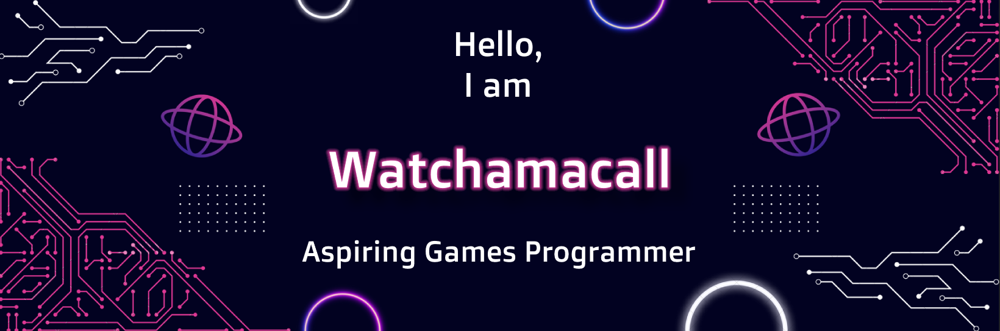

<!-- Big Intro Card -->

<!-- Intro Text -->

  A recent graduate of Falmouth University with a BSc(Hons) in Computing For Games with a final score of 2:1.

  I primarily focus on developing and maintaining Game Mechanics, and I am interested in other aspects of Games Programming such as AI Programming and UI Development. Currently, I have been working on a Google Form integration for both Unreal and Unity allowing for easier Survey integration in games.

  I have been actively marketing myself through my CV and <a href="https://watchamacall.co.uk">portfolio</a> whilst keeping up with the latest technology and learning more everyday. 

<!-- Skills -->

 <table>
   <tr>
    <td><b><h2>Languages</h2></b></td>
    <td><b><h2>Engines</h2></b></td>
   </tr>
   
   <tr>
    <td>
      
      
    </td>
    <td>
      
      
    </td>
   </tr>
   
 </table>  

<h2 align="center">My Github Stats</h2>

[)](https://github.com/anuraghazra/github-readme-stats)

<!---->
<!--
**Watchamacall/Watchamacall** is a ✨ _special_ ✨ repository because its `README.md` (this file) appears on your GitHub profile.

Here are some ideas to get you started:

- 🔭 I’m currently working on ...
- 🌱 I’m currently learning ...
- 👯 I’m looking to collaborate on ...
- 🤔 I’m looking for help with ...
- 💬 Ask me about ...
- 📫 How to reach me: ...
- 😄 Pronouns: ...
- ⚡ Fun fact: ...
-->
